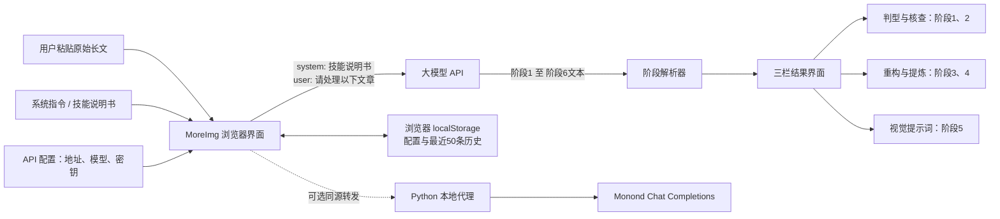

# MoreImg 实现原理与 SOP 覆盖分析

## 结论

MoreImg 是一个“可配置大模型工作台”，不是把内容加工方法写死在程序里的专用引擎。它把用户填写的**系统指令（System Prompt）**视为技能说明书，并在每次处理文章时，将“技能说明书 + 原始文章”一并提交给兼容 OpenAI Chat Completions 的模型接口。

因此，题述的六阶段 SOP 可以直接作为该应用的系统指令使用：SOP 决定模型要做什么、如何输出；MoreImg 则负责发起调用、按阶段展示、复制提示词和保存历史。

## 一、整体架构



## 二、代码分层与职责

| 层级 | 文件 | 职责 |
| --- | --- | --- |
| JSX 源码 | `src/` | React 单页应用：模板、存储、提示词、协议、请求、卡片组件和页面装配。 |
| 构建脚本 | `build.mjs` | 聚合 `src/` 生成 `src.html`，再用本地 Babel 生成 `app.js` 与运行用 `index.html`。 |
| 运行产物 | `src.html`、`index.html`、`app.js` | 兼容测试审计的聚合源码，以及浏览器实际加载的页面与编译后逻辑；均不直接编辑。 |
| 样式与依赖 | `styles.css`、`vendor/` | 本地 React、ReactDOM、Lucide、Babel 等，避免运行时依赖公开 CDN。 |
| 本地服务 | `server.py` | 提供静态文件，并可将同源 `/v1/chat/completions` 转发到 Monond 接口，以规避浏览器跨域限制。 |

源码修改应落在 `src/` 对应模块，之后执行 `node build.mjs` 更新 `src.html`、`index.html` 与 `app.js`。

本地代理**不会自动接管请求**。默认接口地址是 DeepSeek 地址；只有在设置中将接口地址改为 `http://127.0.0.1:4187/v1/chat/completions`，并通过 `python3 server.py` 启动服务时，请求才会进入该代理，随后被转发到代码中固定的 Monond 上游。

## 三、“技能说明书覆盖流程”的具体机制

### 1. 技能不是内置代码，而是运行时配置

设置弹窗中有“接口地址、模型名称、密钥、系统指令”四项。应用启动后会从浏览器 `localStorage` 读取：

- `agent_api_config`：接口地址、模型、密钥、系统指令；
- `agent_history`：完整输出、原始文章及展示状态。

点击“保存并应用配置”后，系统指令被保存；没有填写密钥或系统指令时，“一键提取提示词物料包”按钮不可用。应用本身不内置题述 SOP 的正文，发布版默认系统指令为空。

这意味着同一个界面可换用不同技能：例如“六阶段知识卡片 SOP”“只做卡片文案 SOP”“只做视觉提示词 SOP”。改变系统指令即改变业务行为，无需改前端代码。

### 2. 一次请求完成整个业务链

处理时，前端构造的消息结构为：

```text
system: {设置中保存的系统指令}
user: 请处理以下文章：\n\n{用户输入的原始长文}
```

随后以 `model`、`temperature: 0.7`、`stream: false` 发往设置的 Chat Completions 地址。应用不会把阶段1到阶段6拆成六次独立模型调用；它要求模型在**一次回答**内按阶段顺序完成全部交付。

优点是配置简单、上下文完整；代价是每一步不能由应用独立校验、重试或回滚，质量主要取决于系统指令、所选模型和模型是否遵守输出格式。

### 3. 阶段文本驱动界面，不是状态机驱动模型

前端用正则识别行首的“阶段1”至“阶段6”（兼容 `### 阶段1`、`[阶段1]`、`**阶段1**` 等写法），并把各段文字写入 `stages[1..6]`。这是一种**输出后解析**：

- 模型写出“阶段1”后，界面认为当前进度进入阶段1；
- 模型漏写、错写或换了不兼容标题，内容可能全部落入阶段1；
- 若最终只识别到阶段1，应用将任务视为中止，并锁定后续标签页。

所以题述 SOP 应显式要求模型在每一段开头输出独占一行的 `阶段1`、`阶段2`……`阶段6`。这比只写“阶段1：原料接收与判型”更稳妥；后者通常也能识别，但独占标题更不易被 Markdown 或正文干扰。

### 4. UI 将六阶段压缩为三个阅读区

| 界面标签 | 实际展示阶段 | 展示方式 |
| --- | --- | --- |
| 判型与核查 | 1、2 | 普通 Markdown 内容。 |
| 重构与提炼 | 3、4 | 阶段3渲染为文章；阶段4按 `**…卡片…**` 标题切成 3:4 比例的卡片容器。 |
| 视觉提示词 | 5 | 按 `### [封面]`、`### [正文1/N]` 等标题拆成可单独复制的提示词块，并提供“复制全部”。 |

阶段6会被解析和保存在历史中，但当前 UI 没有单独展示它。它适合由模型静默执行；如果需要把“质量自检报告”展示给用户，需要新增一个结果区或将阶段6并入现有页面。

### 5. 提示词复制为什么依赖固定格式

阶段5优先提取第一个包含标签的 Markdown 代码块作为“全套指令”；没有总览代码块时，再按 `### [卡片类型]` 分段拼接。因此题述 SOP 规定的以下格式刚好适配：

```markdown
```text
[封面]
...提示词...

[正文1/N]
...提示词...
```

### [封面]
```text
...提示词...
```
```

总览代码块供“复制全部”，拆分版供逐张复制。二者都保留时，当前界面能稳定工作。

## 四、题述六阶段 SOP 的覆盖情况

| SOP 阶段 | MoreImg 前端能做的事 | 由技能说明书 / 模型承担的事 | 当前边界 |
| --- | --- | --- | --- |
| 1. 判型 | 接收文章、显示阶段1、在仅有阶段1时判定停止。 | 判断主题、观点、分论点和篇幅；输出不通过提示。 | “至少3张卡片”的判断不是程序规则，完全依赖模型。 |
| 2. 事实核查与拆解 | 显示阶段2文本。 | 搜索、交叉验证、标记存疑、输出错误/过时/逻辑问题与骨架。 | 前端没有搜索工具、来源字段或引用校验能力。模型是否真能联网取决于所选 API/模型。 |
| 3. 框架重建 | 将阶段3按 Markdown 阅读。 | 改正事实、修补逻辑、生成精修版文章和副标题。 | 应用不会逐条验证“未引入新论点”。 |
| 4. 卡片内容包 | 尝试以粗体“卡片”标题切成卡片容器。 | 提取封面、正文、封底字段。 | 若标题不含“卡片”或格式变化，会退化为普通文本展示；卡片数量/字段不做机器校验。 |
| 5. 视觉指令 | 分段展示、单张复制、复制全部。 | 确定色彩、主视觉、排版并生成中文超级提示词。 | 不生成图片，也不验证文字是否完整进入提示词。 |
| 6. 自检 | 无可视化结果区。 | 对完整性、对应性、比例与格式进行最终复核，并回退修正。 | 自检只是一段模型指令，不能触发应用级自动回退或重新请求。 |

## 五、与当前 Codex `MoreImg` 技能的关系

当前技能文件位于 `/Users/wulinpo/.codex/skills/moreimg-skill/SKILL.md`，它和这个应用属于同一类问题，但产品化方向不同：

| 对比项 | MoreImg Web 应用 | 当前 Codex MoreImg 技能 |
| --- | --- | --- |
| 核心机制 | 用户手动粘贴任意系统指令，模型一次完成工作流。 | 将文章规范化为 Page Spec，再生成 `cards.md` 与 `prompts.md`。 |
| 默认交付 | 六阶段文本，重点是可复制视觉提示词。 | 两份 Markdown 文件内容，重点是可复用的语义规格与风格锁。 |
| 视觉规范 | 取决于用户注入的 SOP。 | 一个 Style Lock + 每页结构化 Page Prompt，默认 `[3:4, 1K]`。 |
| 事实核查 | 可在系统指令中要求，但应用不提供工具保障。 | 仅在存在明显时效风险时给风险提示，默认不做长核查报告。 |
| 风格复用 | 没有文件化风格库；需自行替换系统指令。 | 支持读取、调用、保存 `styles/` 下的风格锁。 |

结论：题述 SOP 可以作为 MoreImg Web 应用的“兼容技能说明书”；但它不是当前 Codex MoreImg 技能的逐字实现。尤其是当前技能默认不输出六阶段报告、默认不生成封底、也不采用题述的旧式统一提示词前缀。

## 六、使用题述 SOP 的推荐配置

1. 在 MoreImg 设置中填入兼容 Chat Completions 的接口地址、模型与密钥。
2. 将题述六阶段 SOP 完整粘贴进“系统指令”。
3. 在激活指令前补充一条格式约束：

   ```text
   每个阶段必须从独占一行的“阶段N”开始；阶段5必须同时给出一个总览代码块和以“### [封面]”“### [正文1/N]”“### [封底]”开头的拆分版；阶段6请在末尾输出简短自检结论。
   ```

4. 粘贴文章并点击“一键提取提示词物料包”。
5. 在“视觉提示词”页使用“复制全部”或逐张复制，粘贴到目标生图工具。

若接口没有联网检索能力，应把阶段2调整为“基于可访问资料核查；无法核实一律标记存疑”，避免把“必须联网核查”误认为 MoreImg 本身能提供的能力。

## 七、重要限制与改进建议

### 现有实现的限制

- **无真实工作流编排**：六阶段并非六个可观测、可重试的任务节点，而是一条长提示词中的模型自述。
- **无受控联网核查**：`server.py` 只负责转发聊天请求，不提供搜索、网页抓取、知识库检索或双来源比对。
- **无结构化校验**：阶段结果为 Markdown 字符串；没有 JSON Schema、字段必填检查、卡片数量检查或“3:4”检查。
- **阶段6不可见**：质量自检结果没有对应的展示标签。
- **历史仅保存在当前浏览器**：清理浏览器站点数据会丢失密钥、系统指令与历史；也不适合作为团队共享的技能版本库。
- **密钥安全取决于设备环境**：密钥不会写入项目文件，但会明文保存在该浏览器的 `localStorage` 中；共用设备需谨慎。

### 如要把 SOP 从“提示词约束”升级为“可靠应用流程”

建议按收益从高到低逐步演进：

1. **要求结构化输出**：让模型同时返回 JSON（`stage1` 至 `stage6`、`cards`、`prompts`），前端用 Schema 校验关键字段。
2. **拆分模型调用**：判型通过后才调用核查；核查后才重构；将阶段6的校验失败自动回传给对应阶段修正。
3. **接入可追溯检索**：由服务端统一调用搜索/知识库，向模型提供带 URL、日期和来源的证据，满足双来源核验而不是仅靠模型声明。
4. **增加阶段6结果区**：显示检查清单、失败项与最终修订版本，便于人工验收。
5. **技能版本化**：把 SOP 存为项目内 Markdown 文件，界面只选择版本，不让用户每次手工粘贴；同时记录每次历史使用的 SOP 版本。

这些改进会将应用从“通用 Prompt 壳”变成“可验证的内容生产工作流”。在当前需求下，直接用系统指令覆盖流程仍是最小、最灵活的方案。

## 八、关键源码定位

- `src/app.jsx`：`handleStartProcessing` 负责构造系统消息和用户消息、调用接口、读取普通 JSON 或 SSE 形式响应、保存历史。
- `src/core/processing.js`：`parseStreamedText` 负责依据“阶段1—阶段6”切分模型文本。
- `src/app.jsx`：`renderStageContent` 负责将阶段1/2、3/4、5分别渲染为报告、文章/卡片和提示词复制块。
- `src/core/processing.js`：提示词解析函数负责从总览代码块或拆分版标题中提取可复制内容。
- `server.py`：仅转发 `/v1/chat/completions` 到预设上游，不修改模型消息，也不实现事实核查。

## 九、验证建议

用一篇具备主题、三条以上分论点、且至少包含一条可核验事实的文章试跑一次，重点检查：

- 是否确实出现阶段1至阶段6，且阶段5同时有总览与拆分版；
- 阶段1不通过时是否只输出判型结果；
- 阶段4是否以包含“卡片”的粗体标题分块显示；
- “复制全部”是否得到封面、全部正文和封底，不混入解释文字；
- 若声称完成联网核查，是否附带可人工复查的来源和日期。
